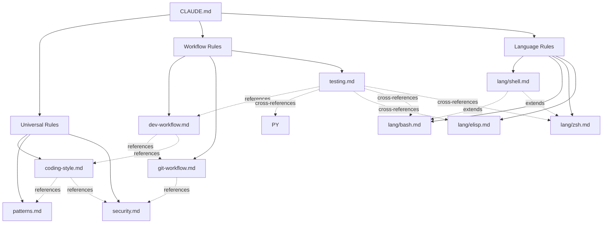

# Configuration Rules Documentation

## Overview

This directory contains modular rules for Claude Code assistance in the oh-my-workspace project.

**Loading Strategy:**
- **Universal + Workflow rules** (6 files): Auto-loaded for all tasks
- **Language-specific rules** (`lang/` directory): Conditionally loaded based on file type

## Rule Categories

### Universal Rules (auto-loaded)

These rules define core standards that apply across all file types:

- **`coding-style.md`** - Universal coding standards including line length (80 chars), mandatory file headers, documentation requirements, naming conventions, and code quality principles
- **`patterns.md`** - Design patterns and anti-patterns including immutability principle, file organization, modular configuration patterns
- **`security.md`** - Security best practices for secrets management, input validation, safe file operations, and incident response

### Workflow Rules (auto-loaded)

These rules define development processes and conventions:

- **`dev-workflow.md`** - Research-first development methodology with planning, implementation, dotfiles quality rules, and rollback strategies
- **`git-workflow.md`** - Git conventions including Conventional Commits format, branch naming, merge strategies, and dotfiles-specific commit practices
- **`testing.md`** - Universal testing principles for configuration changes, including syntax validation, functional testing, and integration testing workflows

### Language-Specific Rules (conditionally loaded)

Located in the `lang/` subdirectory, these rules extend universal standards with language-specific features:

| Rule File | Globs | Description |
|-----------|-------|-------------|
| `lang/shell.md` | `**/*.sh`, `**/*.bash` | Universal shell practices |
| `lang/bash.md` | `**/*.sh`, `**/*.bash` | Bash-specific features |
| `lang/zsh.md` | `**/*.zsh`, `**/.zsh*`, `**/zshrc`, `**/zprofile`, `**/zshenv`, `**/zlogin` | Zsh-specific features |
| `lang/elisp.md` | `**/*.el` | Emacs Lisp conventions |
| `lang/config.md` | `**/config`, `**/*.conf`, `**/*.cfg`, `**/rc`, `**/.gitconfig`, `**/git/config` | Configuration files (no extension) |
| `lang/toml.md` | `**/*.toml` | TOML configuration files |
| `lang/yaml.md` | `**/*.yml`, `**/*.yaml` | YAML configuration files |

## Conditional Loading System

### How It Works

Language-specific rules use YAML frontmatter with `globs` field:

```yaml
---
globs:
  - "**/*.py"
  - "lang/python/**"
---
```

**Behavior:**
- Universal and workflow rules are always loaded
- Language rules load only when editing matching files
- Multiple language rules can apply (e.g., `.sh` files load both `shell.md` and `bash.md`)

### Glob Pattern Syntax

| Pattern | Matches | Example |
|---------|---------|---------|
| `**/*.py` | All `.py` files at any depth | `script.py`, `utils/helper.py` |
| `emacs/**` | All files under directory | `emacs/init.el` |
| `setup.sh` | Specific file | `setup.sh` |

**Notes:**
- Patterns are case-sensitive
- Multiple matching rules are all loaded (additive)

## Usage Examples

### Editing Python Files
**Auto-loaded:** All 6 universal + workflow rules

### Editing Shell Scripts
**Auto-loaded:** All 6 universal + workflow rules
**Conditionally loaded:** `lang/shell.md`, `lang/bash.md`

### Editing Zsh Files
**Auto-loaded:** All 6 universal + workflow rules
**Conditionally loaded:** `lang/shell.md`, `lang/zsh.md`

## Rule Dependencies

The following diagram shows how rules reference and depend on each other:



**Legend:**
- **Solid arrows**: Direct categorization (CLAUDE.md → rule categories)
- **Dotted arrows**: References and dependencies (rule → rule)

**Key Dependencies:**
- `lang/bash.md` and `lang/zsh.md` both extend `lang/shell.md`
- `coding-style.md` references `patterns.md` and `security.md`
- `dev-workflow.md` references `git-workflow.md` and `coding-style.md`
- `testing.md` provides universal testing principles with cross-references to language-specific testing

## Adding New Rules

### For New Languages

1. Create new file in `lang/` directory: `lang/newlang.md`
2. Add frontmatter with appropriate globs:
   ```yaml
   ---
   globs:
     - "**/*.newlang"
     - "newlang/**"
   ---
   ```
3. Extend universal rules with language-specific conventions
4. Update this README.md with the new rule

### For New Workflow Patterns

1. Create new rule file in rules root (no globs needed - will auto-load)
2. Follow existing documentation patterns
3. Cross-reference related rules
4. Update this README.md

## Rule Documentation Standards

Each rule file should include:

1. **Clear title and purpose** - What the rule covers
2. **References** - Links to authoritative style guides
3. **Examples** - Concrete code examples showing good vs bad patterns
4. **Rationale** - Why the rule exists
5. **Cross-references** - Links to related rules

## Maintenance

### When to Update Rules

- Adding new programming languages or tools
- Discovering new best practices
- Addressing recurring issues in AI-generated code
- Updating to newer versions of style guides

## Related Documentation

- **Project root**: `/CLAUDE.md` - High-level project guide
- **Setup script**: `/setup.sh` - Installation and stow operations
- **Main README**: `/README.md` - Project overview and features
